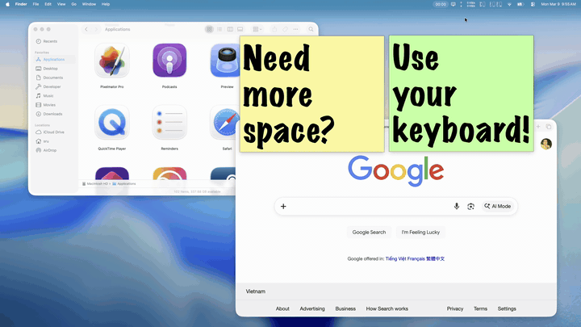

# Fuji

A lightweight macOS menu bar app for switching display resolutions with a keyboard shortcut or a click.

  

Fuji lives in your menu bar and gives you fast access to every available resolution for all your connected displays. Step your resolution up or down with a keyboard shortcut, save named presets for your favorite configurations, and switch between them instantly — no digging through System Settings required.

## Features

- **Quick resolution stepping** — press **⌃⌥↑** / **⌃⌥↓** to bump your resolution up or down instantly, no setup needed
- **Browse all resolutions** for every connected display, right from the menu bar
- **Save presets** with custom names for your preferred display configurations
- **Global keyboard shortcuts** to switch presets without touching the mouse
- **Multi-display support** — configure and switch resolutions across all your monitors at once
- **HiDPI aware** — clearly identifies Retina and non-Retina modes
- **Automatic updates** — Fuji checks for updates in the background so you always have the latest version
- **No trackers, no analytics** — Fuji's only network access is checking for updates, and you can turn that off too

## Requirements

- macOS 26.0 or later
- Accessibility permission (Fuji will guide you through enabling this on first launch — it's needed for global keyboard shortcuts)

## Installation

1. **[Download the latest release](https://github.com/uffelman/Fuji/releases/latest/download/Fuji.zip)**
2. Unzip the file and drag **Fuji.app** to your Applications folder
3. Open Fuji — it will appear as an icon in your menu bar

Future updates are delivered automatically through the app.

You can also find all releases on the [Releases page](https://github.com/uffelman/Fuji/releases).

## Getting Started

Once Fuji is running, click its menu bar icon to see your connected displays and their available resolutions.

The fastest way to use Fuji is the built-in resolution stepping shortcuts — **⌃⌥↑** to increase and **⌃⌥↓** to decrease your resolution. These work out of the box with no configuration.

For more control, you can save presets for specific multi-display setups and assign each preset its own keyboard shortcut in Fuji's settings.

## Contributing

Fuji is open source and contributions are welcome! See [CONTRIBUTING.md](CONTRIBUTING.md) for build instructions, project structure, and guidelines for submitting changes.

## Releasing

Maintainers can find the full release pipeline documentation — signing, notarization, CI, and Sparkle appcast updates — in [RELEASING.md](RELEASING.md).

## Support

If Fuji is useful to you, consider [buying me a coffee](https://ko-fi.com/stephenu) — it helps keep the project going.

## License

Fuji is licensed under the [GNU Affero General Public License v3.0](LICENSE).
